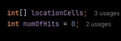
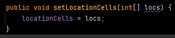
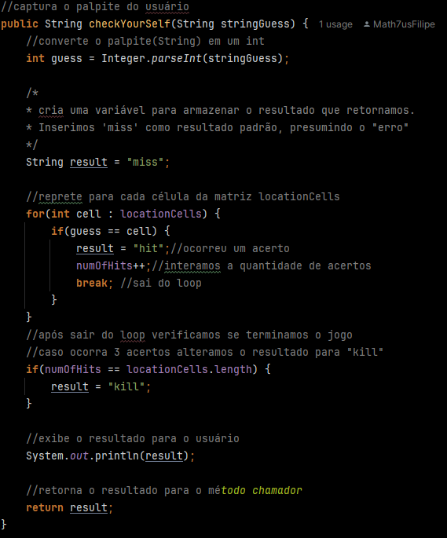
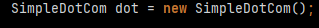
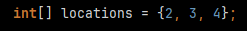
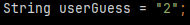
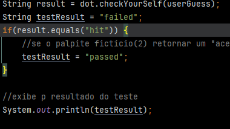

# SimpleDotCom

Temos duas classes, sendo uma delas a `SimpleDotCom` e a outra `SimpleDotComTestDrive`.  
A classe `SimpleDotCom` é responsável pela lógica do código, será nela onde tudo vai acontecer, enquanto a classe `SimpleDotComTestDrive` vai criar uma "simulação" de um jogador.

---

## Classe SimpleDotCom

### Propriedades da classe SimpleDotCom
Temos como propriedade um vetor de inteiros e uma variável `int` que armazena os palpites corretos.  

---

### Método `setLocationCells`
Esse método é responsável por armazenar a localização das células em um array. Ele tem apenas essa responsabilidade e não retorna nada.  

---

### Método `checkYourself`
É o método responsável por verificar os acertos e erros dos palpites dados pelo usuário.
- Temos um `int` chamado `guess` que converte uma `String` em um `int`.
- A `String result` é inicializada com o valor padrão `'miss'`, presumindo um possível "erro".
- Um laço `for` percorre o vetor `locationCells`.
- Dentro do laço, fazemos as verificações, comparando o palpite passado pelo usuário com a localização da célula. Caso o resultado da verificação seja verdadeiro, a variável `result`, que antes tinha sido inicializada como `'miss'`, recebe o valor `'hit'`, e incrementamos os acertos em `numOfHits`.
- Fora do laço `for`, verificamos se o usuário acertou todas as células. Caso tenha acertado, alteramos o valor de `result` para `'kill'`.
- Imprimimos o valor de `result`.  
  

---

## Classe SimpleDotComTestDrive

- Fazemos a instância de um objeto `SimpleDotCom`.  
  

- Criamos um vetor de inteiros para armazenar a localização das `dotCom`.  
  

- Fazemos o palpite do usuário fictício.  
  

- Chamamos o método `checkYourself` e armazenamos o que ele retornar na variável `result`. Criamos uma variável chamada `testResult`, inicializada com `'failed'`. Caso `result` seja igual a `'hit'`, alteramos o valor de `testResult` para `'passed'` e imprimimos o `testResult` na tela.  
  